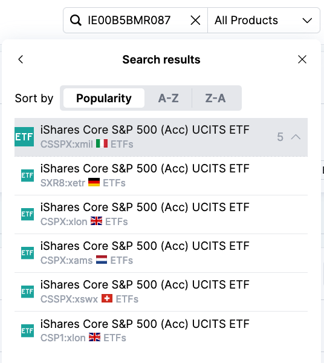

There are over dozens of factors that you should consider when picking any Security:
- Volume
- Liquidity
- Dividend
- Historical performance
- Tax efficiency
- Underlying index and how the stocks are weighed (Funds only)
- Management fees (Funds only)
- ...

It's a lot of work analysing a Security. It's a bad idea buying blindly something someone else suggested. This can become some overly complex territory when weighing all those considerations. 

Diversification is a fundamental principle in investment. However, achieving this diversification yourself with for instance Stocks can be overwhelming. For this reason, we will not delve into Stock investments, as it is a more advanced topic. 

**Our strategy** should focus on ETFs and Danish Exchange Traded Funds that track low-risk indexes. Additionally, we must consider whether we can buy these on an _Aktiesparekonto_ to save at least 10% in taxes or apply other tax-saving methods. Rushing into investments without careful consideration could lead to missing significant tax savings worth thousands of DKK.

#### Low-risk Indexes
Below is a list of widely accepted low-risk indexes:

| Index                               | Description                                                                                                             |
|:----------------------------------- |:----------------------------------------------------------------------------------------------------------------------- |
| S&P 500                             | Tracks the top 500 large cap companies in the United States.                                                            |
| MSCI World Index                    | Tracks 23 developed countries (e.g. USA and Europe) of around 1.500 companies.                                          |
| MSCI Emerging Markets               | Tracks 24 Emerging Market countries (e.g. Indonesia and China) in five different regions and more than 1.400 companies. |
| MSCI All Country World Index (ACWI) | ACWI is a combination of the World Index and Emerging Markets.                                                          |
| MSCI Europe                         | Follows the largest stocks from 15 European Countries                                                                   |

But before we search for ETFs or Danish Exchange Traded Funds that track those indexes, let's take a moment to familiarize ourselves with some concepts and key terms. This will help you distinguish between similar named investments like "ETF A1" and "ETF A2".

#### Identifier: ISIN & Ticker Symbols
The **ISIN** code is the individual securitie's name or address. It is short for **International Securities Identification Number** and consists of a 12-digit code. You can use the ISIN code to look up a security. If you only have the name of the Security, you may be left with many different ETFs to choose from. Many ETFs trade under similar names. They can be for example accumulating or dividend-paying. They could also be traded in different currencies. By using an ISIN code, you are sure that you will find the right Security. You can compare it with a security's **CPR number** or **number plate**.

A **ticker (symbol)** is a shorter and more precise abbreviation, since **it identifies the security at a stock exchange level** (e.g. SXR8 or CSPX).

For example, the "_iShares Core S&P 500 UCITS_" ETF with ISIN "_IE00B5BMR087_" is traded on six stock exchanges. 
 

It has a different ticker symbol depending on where it is traded. In above's picture, "CSPX" exists twice, but these are then even further separated by the colon (:) separator followed by the stock exchange's code _"xlon"_ (London Stock Exchange) and _"xams"_ (Euronext Amsterdam). You should always have an interest to trade on the Stock Exchange in your country or with highest liquidity. 

#### UCITS
UCITS stands for Undertakings for Collective Investment in Transferable Securities. It's a set of rules in the EU governing investment Funds. These rules ensure Funds diversify their investments, manage risks well, and limit exposures. They also regulate how UCITS can be marketed and sold to investors. The main aim is to increase protection for investors. This also means that the underlying assets are generally simple and therefore also easy to understand. Many European ETFs and Danish Exchange Traded Funds are created under the UCITS directive (Sources: [1](https://www.irishfunds.ie/set-up-distribution/fund-types-legal-structures/), [2]()).

#### Share classes: A, B, C, D, ..., X, Y, Z? What do they mean?
When companies or mutual funds issue shares, they often create different types, called share classes where each letter represents a different class. Each class comes with its own set of voting rights, perks for shareholders, like dividend access and for Mutual Funds different entry/exit or annual management fees. 

For example, Google's share structure includes three classes of Stocks: Class A, Class B, and Class C. Class A shares typically have one vote per share and are held by regular investors. Class B shares, primarily owned by the founders, carry higher voting power with 10 votes per share. Class C shares, usually held by employees, have no voting rights. This structure allows the founders to maintain control over major business decisions.

With Stocks: there's no universal rulebook dictating what each class must offer. One company's class B shares may give different rights than a different company's.

With mutual funds, share classes are more standardized. Different classes might have different fees and costs associated with them, but these definitions are consistent across different mutual funds. You can [find those definitions here](https://www.investopedia.com/articles/mutualfund/05/shareclass.asp).

For Exchange-Traded Funds (ETFs) and Danish Exchange-Traded Funds, share classes don’t really apply. They don’t offer voting rights, and the fees are the same for everyone, so there’s no need for different classes.

#### Picking betwen similar looking Securities
When looking for instance for an _S&P 500_ ETF, you may find yourself overwhelmed by dozen or hundreds of options:
- _iShares Core S&P 500 ETF (IVV)_
- _iShares Core S&P 500 UCITS ETF USD (IUSA)_
- _Vanguard S&P 500 ETF (VOO)_
-  _iShares Core S&P 500 (Acc) UCITS ETF (SXR8)_
- _SPDR S&P 500 ETF (SPY)_
... to name a few. This is quite common for funds since there is not one fund that could track e.g. the S&P 500.

However, why are there so many if all they do is track the same index?

Well, each one has different features — some might be cheaper, some might be easier to buy depending on where you live, and some might come with extra benefits like tax efficiency. The key differences can be:

- **Costs**: Some have higher management fees than others. For example, _SPDR S&P 500 ETF (SPY)_ is at 0.0945%, which is more than triple of _Vanguard S&P 500 ETF (VOO)_ or _iShares Core S&P 500 ETF (IVV)_ rate of 0.03%.
- **Accessibility**: Some are designed for investors from certain countries or those who use specific currencies. For example, _iShares Core S&P 500 ETF (IVV)_ is traded in the US or Australia in their local currencies (USD and AUD), whereas [_iShares Core S&P 500 UCITS ETF USD (IUSA)_](https://morningstar.dk/dk/funds/SecuritySearchResults.aspx?search=IE0031442068) is traded in Europe on German, British, Swiss and other countries in their local currencies (GBP, EUR, CHF).
- **Tax considerations**: Depending on where you live and where the fund is based, you might pay different amounts of tax on your investment profits. For example, since _iShares Core S&P 500 UCITS ETF USD (IUSA)_ ETF is on "SKATs positivliste", you pay a minimum of 27% (or 17% with an _Aktiesparekonto_), instead of 37%. Furthermore, the ETF is registered in Ireland, where ETF dividends are taxed at 0%.
- **Liquidity**: How easy it is to buy or sell the fund. [Two primary indicators of liquidity are the funds trading volume and the spread ratio](https://www.investopedia.com/articles/exchangetradedfunds/08/etf-liquidity.asp). For example, _iShares Core S&P 500 ETF (IVV)_ has [a daily average volume trade volume of 5.5 Million with a spread rate of 0.01%.](https://www.morningstar.com/etfs/arcx/ivv/quote), meaning it's easy to buy and sell.
- **Accumulating or Dividends**: Some funds like _iShares Core S&P 500 (Acc) UCITS ETF (SXR8)_ are accumulating, others are returning the dividends to the investors like the _iShares Core S&P 500 UCITS ETF USD (IUSA)_.

From a Denmark viewpoint, the _iShares Core S&P 500 (Acc) UCITS ETF (SXR8)_ is a great option between all other S&P 500 ETFs since it has:
- low costs of 0.07%
- traded on European Markets like XETRA and the Danish currency always closely follows the Euro, meaning you are not risking high losses due to currency market changes like with USD
- on "SKATs positivliste", meaning you pay a minimum of 27% (or 17% with an _Aktiesparekonto_), instead of 37%.
- registered in Ireland with no additional ETF dividend fee
- is highly liquid
- accumulating, meaning gains are reinvested into the ETFs yielding probable greater returns in the future but is inventory taxed (Dk: Lagerprincippet)

#### Choosing a Securit that is traded on several Stock Exchange
How to decide when a Security like a Stock or ETF is traded on multiple exchanges?
As we've seen with our _iShares Core S&P 500 (Acc) UCITS ETF (SXR8)_ with ISIN "_IE00B5BMR087_", the ETF is traded on more than 6 stock exchanges.

You should choose the stock exchange with **highest liquidity** and if the Security pays dividends, then you should choose [the country with the best tax conditions.](https://github.com/dk-invest-101/DK-Investing-101/blob/main/0.6%20Taxes.md#double-taxation-on-foreign-stocks--etfs-dividends) 

If you're buying the security with a different **currency** from your investment account, the currency part doesn't really matter much. The conversion rate remains consistent with Saxo and Nordnet.
**Securities like ETFs and Stocks have a base currency**, but they can be traded in various currencies without affecting their underlying value. For example, take the _iShares Core S&P 500 (Acc) UCITS ETF (SXR8)_ ETF, [which base currency is USD](https://www.ishares.com/uk/professional/en/products/253743/ishares-sp-500-b-ucits-etf-acc-fund?switchLocale=y&siteEntryPassthrough=true). If you buy it on the German stock exchange using Euros, its value will still mirror the movements of the US dollar, just as if you bought it directly on the Swiss Exchange, where it's listed in USD.

> ##### Fun Fact:
> - [Danish National bank keeps the DKK exchange rate fixed against the Euro at 1 EUR = 7,46 DKK](https://www.nationalbanken.dk/en/what-we-do/stable-prices-monetary-policy-and-the-danish-economy/learn-about-inflation-interest-rates-and-the-fixed-exchange-rate-policy)
> - Currencies are not bound to a stock exchange's location. For example, the "_iShares Core S&P 500 (Acc) UCITS ETF (CSSP:xswx)_", traded on the Swiss Exchange is traded in USD, instead of the country's Swiss Frank (CHF) currency.

## ETF Recommendations
Your first priority is to take advantage of the _Aktiesparekonto_ with only 17% taxes. Since Securities on an _Aktiesparekonto_ are inventory taxed (Dk: Lagerprincippet) anyway, we can neglect the fact that ETFs are also inventory taxed and make most out of it by picking accumulating ETFs.

Now you should be ready to understand the following selection of recommended ETFs, which are a great choice for an _Aktiesparekonto_!

|  ETF name                                               |  Ticker  |  Tracking Index         |  ÅOP (Eng: TER)  |  Fund size (in billion $)  |  Currency  |  Gain in 2020  |  Gain in 2021  |  Gain in 2022 (Corona Year)  |  Gain in 2023  |  Gain YTD  |  Gain 5Y  |  Gain in 3M  |  Gain in 1W  |
|:---------------------------------------------------------|:---------|:------------------------|:-----------------|:---------------------------|:-----------|:---------------|:---------------|:---------------|:---------------|:-----------|:----------|:-------------|:-------------|
|  iShares Core S&P 500 UCITS ETF (Acc)                    |  SXR8    |  S&P 500                |  0,07%           |  85,273                    |  USD       |  14,16%        |  29,99%        |  -8,48%        |  19,09%        |  10,39%    |  99,33%   |  2,07%       |  -0,63%      |
|  iShares Core MSCI World UCITS ETF USD (Acc)             |  EUNL    |  MSCI World Index       |  0,20%           |  74,301                    |  USD       |  12,14%        |  23,48%        |  -8,13%        |  17,15%        |  8,90%     |  78,45%   |  2,14%       |  -0,54%      |
|  iShares Core MSCI Emerging Markets IMI UCITS ETF (Acc)  |  IS3N    |  MSCI Emerging Markets  |  0,18%           |  20,003                    |  USD       |  14,44%        |  0,15%         |  -9,28%        |  5,51%         |  2,83%     |  21,55%   |  1,58%       |  -3,30%      |
|  iShares MSCI ACWI UCITS ETF USD (Acc)                   |  IUSQ    |  MSCI ACWI              |  0,20%           |  13,442                    |  USD       |  11,86%        |  20,21%        |  -8,30%        |  15,73%        |  8,29%     |  69,49%   |  2,16%       |  -0,77%      |
|  iShares Core MSCI Europe UCITS ETF EUR (Acc)            |  EUNK    |  MSCI Europe            |  0,12%           |  8,176                     |  EUR       |  2,32%         |  17,34%        |  -4,27%        |  13,80%        |  8,17%     |  52,13%   |  5,49%       |  0,03%       |
|  Amundi MSCI World V UCITS ETF (Acc)                     |  LCUW    |  MSCI World Index       |  0,12%           |  5,287                     |  USD       |  12,23%        |  23,32%        |  -8,34%        |  17,03%        |  8,85%     |  77,42%   |  2,02%       |  -0,63%      |  

Source: www.JustETF.com on 05.06.2024

> ##### Why mainly "iShares" ETF?
> iShares are ETFs provided by BlackRock, the biggest asset manager in the world, and have a big footprint in Europe. Moreover, many (not all) iShares ETFs are registered in Ireland, where ETFs dividends are taxed at 0%. However, you should not focus solely on iShares ETFs. It's a coincidence that this selection mainly has index-tracking ETFs from iShares.

> ##### EUNL vs LCUW?
> When searching online, most sources recommend EUNL with 0,20% yearly management fee, eventough LCUW only has 0,12%. Why is that?
> EUNL from iShares has been around since 2009 with a substantial fund size of 74 billion USD and is registered in Ireland with a 0% dividend taxation, meaning you'll be entirely taxed in Denmark. 
> Comparetively, LCUW from Amundi exists only since 2019, has a smaller fund size of only 5 billion USD and is registered in Luxembourg with a 15% dividend taxation, meaning you'll be 15% taxed in Luxembourg and the rest of the 27% (or more) in Denmark. 
> EUNL has been popular due to its age and liquidity. However, LCUW might be a better alternative due to it's 0,08% lower yearly management fee.

> ##### Shouldn't EUNL and LCUW have the same yearly gains since both track the same index?
>  Yes, but no. You see, fund managers have the option to mirror the index exactly 1-to-1, known as Full Replication. However, replicating an index can sometimes be expensive. In such cases, fund managers may choose to partially follow the index, known as Optimized Sampling. 
>  EUNL is an Optimized Sampling ETF, while LCUW is a Full Replication ETF. This difference in strategy leads to the minor variation in their gains.
> Neither approach is inherently better; the choice depends on the specific index, market conditions, and the goals of the ETF provider.

### Picking an ETF for you _Aktiesparekonto_
Now it's time to decide whether you want to rely on one ETF or diversify with two or three selections. From the recommendations table, _iShares Core S&P 500 UCITS ETF (Acc) (SXR8)_ has outperformed every other ETF and has one of the lowest ÅOP/TER. However, can you rely on historical data to say that the USA will continue to outperform?

Some reliable sources like [Morningstar](https://www.morningstar.com/news/marketwatch/20240513112/international-stocks-are-poised-to-beat-the-sp-500-heres-why) and the [International Monetary Fund (IMF)](https://www.imf.org/en/Publications/WEO/Issues/2024/04/16/world-economic-outlook-april-2024) forecast that Emerging Markets will outperform the USA or World (developed markets index) in the coming years. Here may be some reasons for it:
- Taiwan Semiconductor Manufacturing Company (TSMC) and Samsung (South Korea) are leaders in the semiconductor industry, critical for global technology supply chains.
- [India's GDP growth rate was around 7%](https://www.weforum.org/agenda/2024/01/how-india-can-seize-its-moment-to-become-the-world-s-third-largest-economy/), significantly higher than the [USA growth rate of about 2%](https://www.macrotrends.net/global-metrics/countries/USA/united-states/gdp-growth-rate) in 2022.
- [Brazil's index tracker (MSCI Brazil) massively outperformed the S&P 500 in 2022 by 20%](https://ca.style.yahoo.com/finance/news/heres-why-brazil-etfs-breezing-120012825.html).

But these are only forecasts. Anything can happen at any time. Political events, wars, or natural disasters could affect them.

The **_iShares MSCI ACWI UCITS ETF USD (Acc) (IUSQ)_ is the most neutral choice**. The [MSCI ACWI consists of 62% USA-based companies](https://www.msci.com/research-and-insights/visualizing-investment-data/acwi-imi-complete-geographic-breakdown), which are primarily included in the S&P 500, so you're not missing out on the "S&P 500 performance".

Picking any other ETF is actually an active guess that certain parts of the world market will perform better than others. Regardless of which one you pick, looking only at the historical data, if you had invested 5 years ago, you would have made at least a 30% profit on your investment and not any loss.