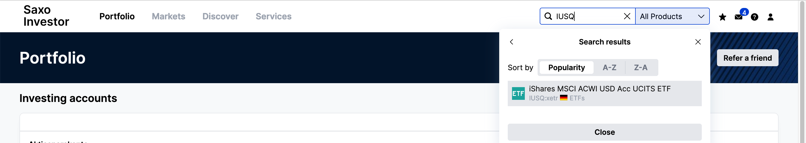
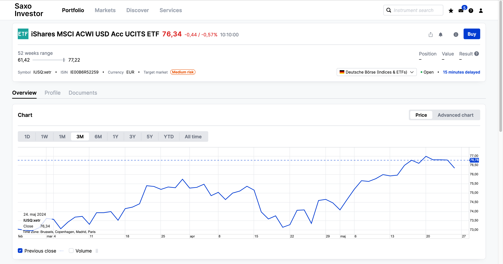
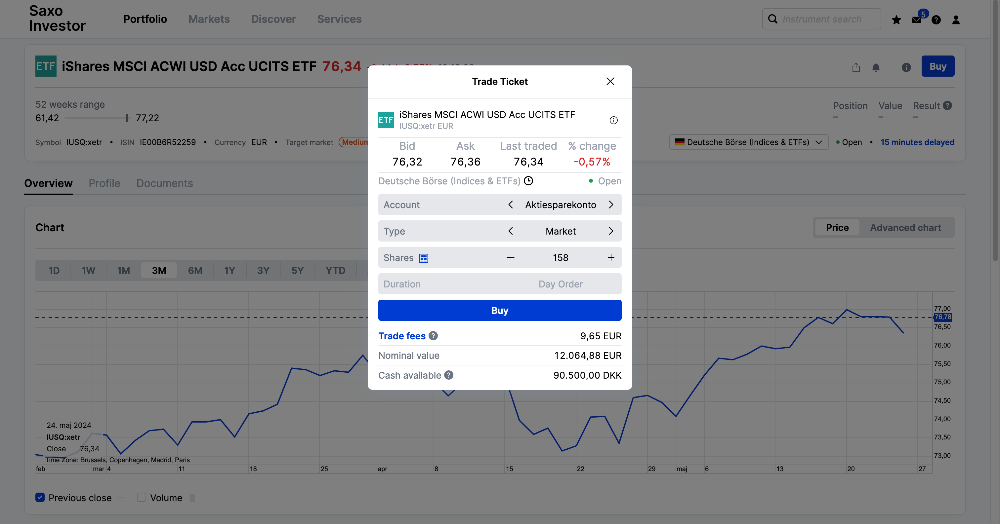
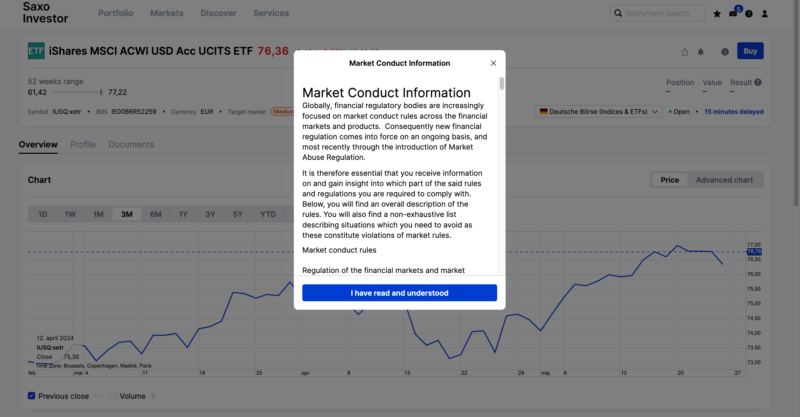
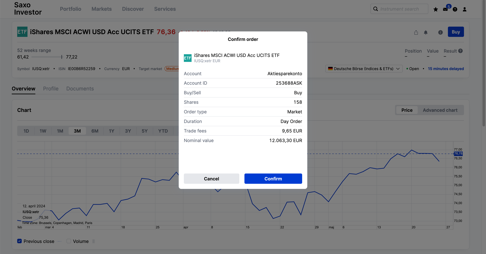
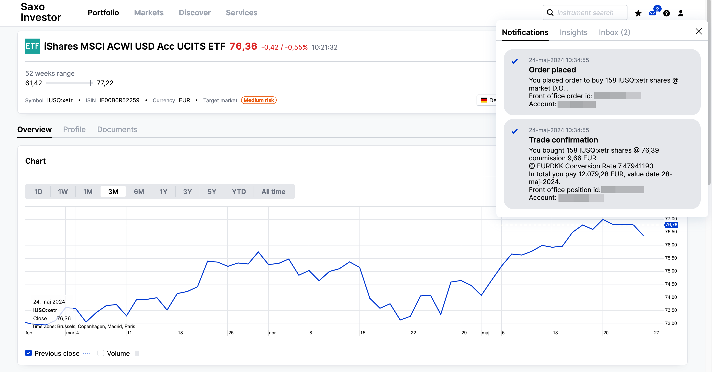
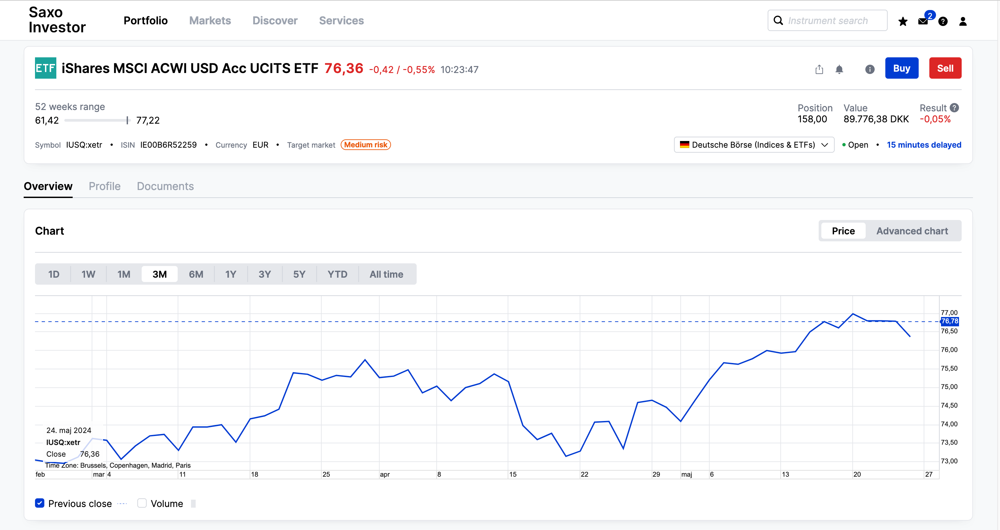
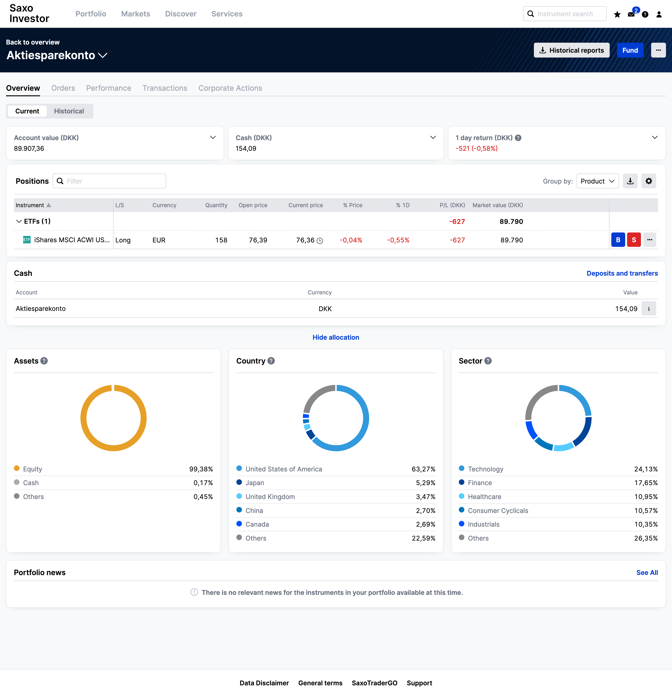

Now that you've learned the basics, let's make our first investment together. We'll be investing 90.000 DKK into an Aktiesparekonto on SAXO, specifically into the _iShares MSCI ACWI UCITS ETF USD (Acc) (IUSQ)_. This should give you some feeling of what happens during an investment. In this Follow-Along, we invest 90.000 DKK all at once. If this is too stressfull for you, you can also split it over several months. [We have a dedicated Q&A for this strategy.](https://dk-invest-101.github.io/QandA#invest-a-large-sum-all-at-once-or-over-a-period-of-months)

#### Step 1: Locate the ETF
Start by typing `IUSQ` in the search bar. The ETF should appear in the search results. Click on it to open its detail page.
 

#### Step 2: Initiate the Purchase
XETRA is a good exchange to trade this ETF since it has high liquidity. Press the blue `Buy` button located at the top right of the page.
 

#### Step 3: Select the Amount
We can't purchase partial shares, so we need to determine how many full shares we can buy with 90.000 DKK. Given the market value for `IUSQ` is 76,36 EUR, we calculate:

(90.000 DKK / 7,46 EUR/DKK) / 76,36 EUR ≈ 158 full IUSQ shares

Ensure you have extra money in the account to cover trading fees. 

Moreover, w choose the `Market` order type, which means buying at the lowest asking price. Since this ETF has high volume, there's no need to worry about surprises that there may only be 100 ETFs at 76,36 EUR available, and the next lowest available ones would then sell for 80 EUR.

#### Step 4: Market Conduct Information
If this is your first trade, SAXO will prompt you to accept their Market Conduct Information notice. This notice informs you about illegal trading activities such as insider trading, where non-public information is used to make profitable trades.

 

#### Step 5: Confirm the Purchase
Confirm your purchase to complete the trade.

 

#### Step 6: Order Receipt
Shortly after placing the order, you'll receive a notification confirming that the trade has succeeded, and you now own 158 IUSQ shares.

 

#### Updated Detail Page View
When you refresh the IUSQ page, you will see your position updated to 158 ETF shares with a value of 89.776 DKK. It's correct that we have less value than the intended 90.000 DKK - remember, we only bought as many full shares as possible! 

 

Your Aktiesparekonto detail page will also show an overview of all your shares. In this case, it will only display the IUSQ shares since this is your sole investment at the moment.

 

