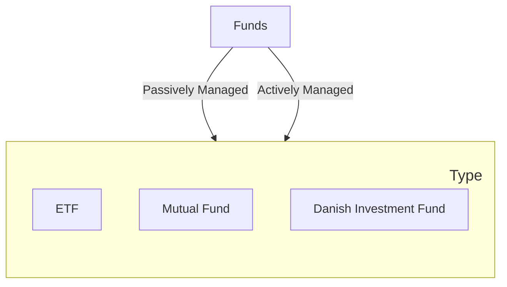

There are many types of investments you can choose from, with each having different risk levels and reward potential. The most basic investment products are:
1. **Stocks** (Dk: _Aktier_): Stocks represent ownership in a company. Think of them as buying a tiny piece of a business, like Apple or McDonald's. If the company does well and earns a lot of money, you might receive a portion of its profits, called dividends. However, if the company doesn't perform well, you can lose money.
2. **Bonds**: Investing in bonds means you're lending money to a corporation or the government. In exchange for your loan, they promise to repay you on a specific date (the maturity date) and pay you periodically interest.
3. **Funds** (Dk: _Fond_): These pool money from multiple investors together to buy various Stocks, Bonds, or other assets. This allows you to diversify your investments with minimal money and spread out your risk.
4. **Options**: Options involve making bets on Stocks without actually buying them. You're predicting whether a Stock's price will rise or fall within a specific period.
5. **Cryptocurrencies**: These digital forms of money, like Bitcoin, are used online and aren't tied to any specific country. They can be risky since their value can change rapidly.
6. **Saving accounts** (Dk: _Opsparingskonto_): Saving accounts with a positive interest rate means the bank pays you to store your money with them. When a customer deposits money into a bank account, the bank effectively uses that money to provide loans to others. The difference between the interest the bank earns on loans and what it pays out on deposits is the bank's income. This is a safe investing method, but promises lower returns than for instance Stocks or Funds.

**The collective term for all these products is _Securities_** (Dk: _Værdipapirer_).

> In Denmark, there are three types off bank accounts    
> - **Current Accounts**: These have various names, such as _NemKonto_, _Girokonto_, _Lønkonto_, _HandelsKonto_, _Aktiedepot_,... and _InvesteringsKonto_ in Denmark. They can be used for investing in Stocks,... etc. or regular bank transfers. Money in these accounts are considered liquid since they can be accessed anytime.
> - **Savings account** (Danish: Opsparingskonto): In these accounts, the bank pays interest on your balance. Money may be locked for a period depending on the account conditions.
> - **"Aktiesparekonto"**: This is a special type of current account for investing with reduced taxes, which we will discuss later.

## Understanding Funds
Let’s break down some key concepts to understand them better.

> Funds are also known as "open-ended," meaning that, unlike Stocks with a fixed number of Shares on the market, new Fund Shares can be issued or reclaimed at any time.

### What is an Index & Index Fund?
An **Index** is a tracker that follows the price of a group of Securities, such as Stocks or Bonds. For instance, the "S&P 500" tracks the stock prices of the 500 largest USA companies. If the average stock price in this group rises, so does the index, and vice versa. It’s important to remember that **you can’t invest directly in an index** — it's just a tracker.

However, you can invest in a Fund that mirrors the movement of an index, known as an **Index Fund**. An Index Fund buys the underlying securities and sells you a share of the fund, allowing you to own a fraction of those securities at a lower cost.

There are multiple types of indexes that follow specific market sectors (e.g. the car industry), topics (e.g. women-led companies), countries (e.g. general market in Korea), and many more.

### Active vs Passive Funds
Funds can be either actively or passively managed:
- **Actively Managed Fund**: These Funds have a professional manager or team making decisions about the underlying investment allocation.
- **Passively Managed Fund**: These Funds usually mirror an index. They tend to be cheaper than Actively Managed Funds, as they don’t require expensive Fund managers and are automated.

Data suggests that passive funds often outperform active ones. [1](https://finance.yahoo.com/news/active-funds-struggle-beat-passive-144140128.html)

### Types of Funds
Now that we understand indexes as well as active and passive funds, let's explore a few selected types of funds you that are not complex:
- **Exchange-Traded Funds (ETFs)**: Typically passively managed, ETFs can be bought or sold during Stock Exchange Market hours, trading like individual stocks. While most ETFs are passive, there are a few actively managed ones, though they are less common. 
- **Mutual Funds**: These Funds are usually actively managed, with their prices (known as Net Asset Value - NAV) updated once daily after the market closes. However, Mutual Funds can also be passively managed, where the fund follows an index. Despite this, they are still pricier than ETFs due to higher administrative fees.
- **Danish Investment Funds** (Dk: (Dansk) Investeringsforening): These are the same as ETFs, but are taxed differently and work slightly differently under the hood.

> ##### Index Funds vs. Mutual Index Funds    
> "Index funds" can refer to both ETFs and Mutual Funds that follow an index. However, in the investment world, Mutual Index Funds are commonly just referred to as "Index Funds." For clarity, we recommend naming them "Mutual Index Funds."

> ##### Stock market opening hours
> Stocks, ETFs and Danish Investment Fund can be bought and sold during certain hours throughout the day. These hours vary by exchange and region. For example, the Saudi Stock Exchange (known as "TADAWUL") operates from Sunday to Thursday.

#### About Danish Investment Funds
From an investor viewpoint, _Danish Investment Fund_ and an ETF differentiate only in three ways:
1. They are taxed differently (which we will see later in [6. Taxes](https://dk-invest-101.github.io/Taxes))
2. There are [about the same number of active and passive Danish Investment Funds](https://www.nordnet.dk/markedet/investeringsforeninger-liste?sortField=yield_1y&sortOrder=descending)
3. _Danish Investment Fund_ prices (Net Asset Value - NAV) must be updated at least three times a day, whereas ETF prices (Net Asset Value - NAV) change constantly ([source](https://www.hemonto.com/hemonto-insights/investeringsforeningerne-suspenderer-handlen/#:~:text=Hvad%20er%20den%C2%A0indre%20v%C3%A6rdi%2C%20og%20hvilken%20betydning%C2%A0har%20den%20for%20handlen%20med%20investeringsforeningsbeviser), [source](https://www.sydinvest.dk/nyheder/magasinet-horisont/suspendering-af-handel-med-fonde))

Otherwise, they are [pretty much the same](https://info.skat.dk/data.aspx?oid=2279779).

##### Terminology and Clarity
Discussions about _Danish Investment Funds_ can be quite confusing. The danes refer to them as "(Dansk) Investeringsforening" (Eng: Investment Association), "Børsnoteret Fond" (Eng: Stock-Exchange Listed Fund, which naming wise should not be confused with Exchange Traded Fund - ETF), or simply "Dansk Fond" (Eng: Danish Fund). This can be quite annoying discussing Funds in a global context. For clarity, **we recommend always referring to them as Danish Investment Funds or "(Dansk) Investeringsforening" in Danish** and nothing else. For example, _Danish Funds_ might also mean Mutual Funds that are registered in Denmark. They also shouldn’t be called Danish ETFs, since there is [only one actual Danish ETF](https://www.invested.dk/trading/basal-trading/passiv-investering-indeks-og-etf#danske).

### Fees
All Investment Funds have fees, which are necessary for the Fund company to offer and operate the Funds. These fees include:
- management fees
- costs of buying/selling investments
- and other fees.

The fee is paid out of your Fund's assets, meaning you are not directly charged.

## What are the differences between Stocks, Shares, and Equity?
Equity and shares may not have been mentioned in the list above because people often use these terms interchangeably. Let's explore their meanings.

A company's Stock consists of Shares. For example, a person might own 100 Shares of Amazon's Stock. One Share is the smallest unit of ownership in a company. So, you buy Shares (portions) of a Stock (collection).

Equity represents the total ownership of a company. If a company has 100 Shares and you own 10, then you own 10% of the company's Equity, or sometimes also referred to as you hold a 10% "Equity stake" in that company.

 

