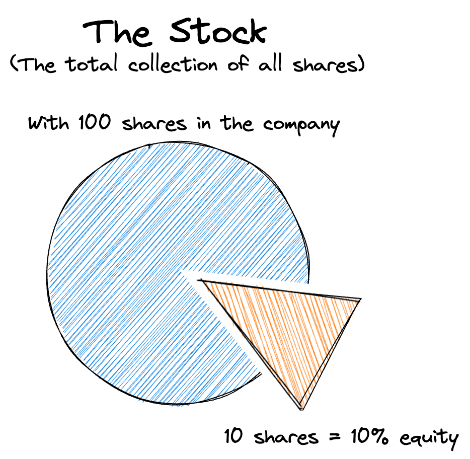

There are many types of investments you can choose from, with each having different risk levels and reward potential. The most basic investment products are:
1. **Stocks**: Stocks represent ownership in a company. Think of them as buying a tiny piece of a business, like Apple or McDonald's. If the company does well and earns a lot of money, you'll receive a portion of its profits, called dividends. However, if the company doesn't perform well, you can lose money.
2. **Bonds**: Investing in bonds means you're lending money to a corporation or the government. In exchange for your loan, they promise to repay you on a specific date (the maturity date) and pay you interest.
3. **Funds**: Investment Funds pool money from multiple investors together to buy various stocks, bonds, or other assets. This allows you to diversify your investments with minimal capital and spread out your risk.
4. **Options**: Options involve making bets on stocks without actually buying them. You're predicting whether a stock's price will rise or fall within a specific period.
5. **Cryptocurrencies**: These digital forms of money, like Bitcoin, are used online and aren't tied to any specific country. They can be risky since their value can change rapidly. In the cryptocurrency realm, real-world money is called fiat money.
6. **Saving accounts**: Saving accounts with a positive interest rate means the bank pays you to store your money with them. When a customer deposits money into a bank account, the bank effectively uses these funds to provide loans to others. The difference between the interest the bank earns on loans and what it pays out on deposits is the bank's income. Savings accounts are a safe way to invest your money, but they offer lower returns compared to stocks.

The collective term for all these products is **securities**.

## Understanding Funds
Funds are a special type of product. Let’s break down some key concepts to understand them better.

#### What is an Index?
An **Index** is a tool that tracks the price of a group of stocks. For instance, the “S&P 500” tracks the stock prices of the 500 largest US companies. If the average stock price rises, so does the index, and vice versa. It’s important to remember that **you can’t invest directly in an index**. However, you can invest in a fund that mirrors an index.

With a fund, you can invest in stocks from a specific sector, topic, country, ..., whatever you feel is the right choice.

#### Active vs Passive Funds
Investment funds can be either actively or passively managed:
- **Actively Managed Fund**: These funds have a manager or team making decisions about the underlying investment allocation.
- **Passively Managed Fund**: These funds mirror an index. They tend to be cheaper than actively managed funds, as they don’t require expensive fund managers.

While some resources advocate for actively managed funds, data suggests that passive funds may often outperform them. [1](https://finance.yahoo.com/news/active-funds-struggle-beat-passive-144140128.html)

#### Types of Funds
You can invest in three main types of funds:
- **Mutual Funds**: Typically actively managed, these can only be traded once a day after the market closes.
- **Index Funds**: These passively managed funds track indexes and can also only be traded once a day.
- **Exchange-Traded Funds (ETFs)**: Commonly passively managed, ETFs can be bought or sold during stock market opening hours. ETF's trade like single stocks on an exchange market.

> **Stock market opening hours**  
> Stocks and ETF's can be bought and sold during certain hours throughout the day. These hours vary by exchange and region. For example, the Saudi Stock Exchange (known as "TADAWUL") operates from Sunday to Thursday.

#### Fees
All investment funds have fees, which are necessary for the fund company to offer and operate the funds. These fees include:
- management fees
- costs of buying/selling investments
- and other fees.

The fee is paid out of your fund's assets, meaning you are not directly charged.

## What are the differences between Stocks, Shares, and Equity?
Equity and shares may not have been mentioned in the list above because people often use these terms interchangeably. Let's explore their meanings.

A company's stock consists of shares. For example, a person might own 100 shares of Amazon's stock. One share is the smallest unit of ownership in a company. So, you buy shares (portions) of a stock (collection).

Equity represents the total ownership of a company. If a company has 100 shares and you own 10, then you own 10% of the company's equity, or sometimes also referred to as you hold a 10% "equity stake" in that company.

 

