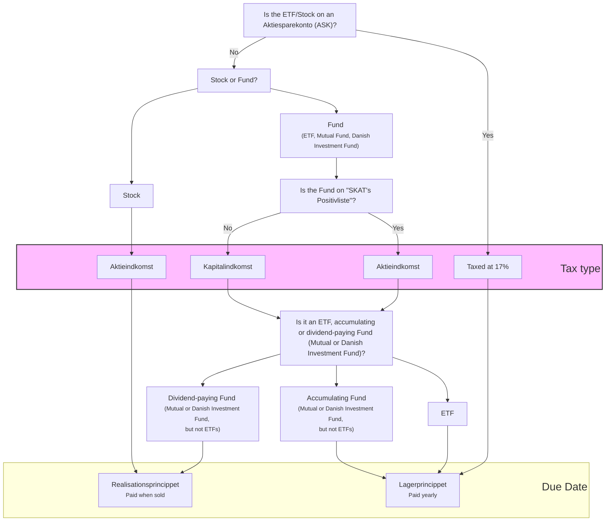

Just like on your salary, you have to pay taxes on investments. Generally speaking, all types of income are taxed, also known as _Income Taxes_. 

Denmark has a progressive tax system, which means that the higher the income, the higher the tax rate, i.e. more tax must be paid on the last DKK earned compared to the first DKK earned, after certain thresholds are reached. You have probably heard about the "Top-skat", meaning you pay 3% more taxes on the yearly income that surpasses 640.109 DKK. 

The income you're most familiar with, e.g. your salary, pension or bonuses, is called _"Personal income"_ (DK: Personlig indkomst).

> ##### SKAT's positivlist  
> The Danish tax authority SKAT has a compilation of specific Funds that meet certain special requirements, are therefore taxed in a different category and thus can have lower tax rates.
> This list is known as SKAT's "PositivList" (Eng: Positive list).

Income generated from investments is generally referred to as _Capital Income_ (DK: Kapitalindkomst). 

However, Denmark actually categorizes this into three income types:
- **Aktieindkomst** (Eng: Stock Income): Income generated from these investments is taxed at a progressive rate. Profit, up to 61.000 DKK (80.000 DKK starting in 2025) is taxed at 27% - thereafter, you will be taxed at 42%. A married couple can combine the total of their profit upper limit, resulting in a limit of 122.000 (160.000 DKK starting in 2025) before being taxed at 42%. "Aktieindkomst" includes the following products:
	- Capital Gains from Stocks (profits from Stocks)
	- dividends from Stocks
	- ETFs, Mutual Funds and Danish Funds that are on SKAT's positive list 
- **Kapitalindkomst** (Eng: Capital Income): All other investment income (e.g. interests generated from saving accounts) or securities not on SKAT's positive list, are taxed as "Kapitalindkomst". Here, the total net amount of all of them is what you are taxed on, but is also affected by your "Personal Income". For example, if you've received +5.000 DKK interest from a savings account, but had to pay -1.000 DKK in interest for a bank loan, then you only pay taxes on 4.000 DKK. The rate depends on the net amount:
	- Positive net capital income up to 50.500 DKK is taxed at 37% - thereafter, you will be taxed at 42%
	- Negative net capital income can be deducted from your municipal and church tax which combined make up 25% or 33% of your monthly personal income taxes
- **Aktiesparekonto** (Eng: Stock savings account): Sometimes referred to as _ASK_, this is a type of investment account available in Denmark. It allows you to invest up to 135.900 DKK (160.000 DKK starting in 2025) in Stocks, Mutual Funds, Danish Investment Funds and ETF’s that are on SKAT’s positive list with a preferential taxation of only 17%. You’re only allowed to have one _Aktiesparekonto_ with any bank.

### When do you pay taxes?
There are two options for when the tax is due:
- **Realisationsprincippet** (Eng: Realisation Principle): You pay tax when you realise a return, which means when you sell a Security or receive a dividend. If you sell shares at a loss, you can offset the loss against your profits. All Stocks and dividend-paying Funds (Mutual and Danish Investment Funds, not ETFs) are taxed using the "Realisationsprincippet".
- **Lagerprincippet** (Eng: Inventory Principle): Tax is paid on investments annually, regardless of whether they are sold. At the end of each year, the increase or decrease in the value of investments is calculated. If the return is positive, tax is paid. If the return is negative, a deduction is received which can be offset against any profit next year. All ETFs, accumulating Funds or Bond-based Funds are taxed following the "Lagerprincippet".

### How do you pay taxes?
When you invest in an **Aktiesparekonto**, taxes are taken care of automatically. Whenever you make money from your investments, taxes are deducted from your account. If you don't have enough cash to cover the taxes, the bank or platform may sell some of your investments or allow your account to go into negative balance to pay the taxes. You'll be notified if this happens and given time (usually 30 days) to add more cash to cover the shortfall. Even if you've already reached the accounts limit of 135.900 DKK (160.000 DKK starting in 2025), you can still add extra cash to cover taxes owed. [Saxo](https://www.home.saxo) is one example where you'll go into a negative balance and add cash to cover for taxes.

**Dividend** taxes are paid automatically upfront. When you receive dividends, 27% (or more) of the amount is withheld by SKAT before the rest 63% (or less) of your dividend is refunded to your account.

All **non-Aktiesparekonto investments** are automatically reported to SKAT if you use a Danish bank or platform. Taxes are then generally collected in connection with the publication of your "Årsopgørelse" (ENG: Annual tax statement) during the month of March.

> You can also choose to pay taxes to SKAT before the end of the year. Some investors pay a 42% tax upfront on any profit from investments, just to not be bothered by figuring out the tax amount. Worst case, you've already covered the taxes what you owe, the best case, you get money back in March if you paid too much in taxes!

### Tax Flowchart

Sources: [1](https://www.nordnet.dk/dk/kundskab/academy/forste-investering/start-her/beskatning-af-investering), [2](https://www.femaleinvest.com/investeringsordbog/kapitalindkomst), [3](https://majinvest.dk/invester-med-maj-invest/fri-opsparing/skatteregler/#Kapitalindkomst), [4](https://debtia.dk/ordbog/kapitalindkomst/), [5](https://skats-positivliste.danielwinther.dk/), [6](https://www.skatteinform.dk/dk/graenser-og-satser/graenser-og-satser/kapitalindkomst/), [7](https://jyskeinvest.dk/skat/ordforklaringer), [8](https://www.nordea.dk/privat/produkter/investering/aktiesparekonto.html), [9](https://www.nykredit.dk/dit-liv/formue/nyheder/2022/02/undga-at-din-aktiesparekonto-bliver-udhulet/)

## Double taxation on dividends on foreign Stocks & Funds
Investing in foreign Stocks or Funds that offer dividends may lead to double taxation, meaning taxation occurs both in the country where the Stock or Fund is registered and in your home country, Denmark in this instance. Each country has its own rules governing dividend taxation, making it crucial to understand the specific regulations of the country where the shares are registered.

> ### Registration country vs. traded country
> Stocks or Funds can be registered in one country, but sold in another one. For example, Apple Stocks can be sold on four stock exchange markets: NASDAQ USA, XETRA Germany, XSWX Switzerland and XMIL Italy even though they are registered only in the USA. Don't assume a stock is registered where it's traded.

Upon receiving dividends from foreign shares, you will **automatically pay** a tax percentage to the foreign tax authority of the registration country. If there exists a double taxation agreement, referred to as _dobbeltbeskatningsoverenskomster_ (DBO, also sometimes known as "dobbeltbeskatningsaftalerne"), between the country in question and Denmark, the dividend is taxed at a maximum of 15% in the registration country, with the remaining taxation (27% - 15% = 13%) conducted by SKAT in Denmark. However, this does not imply that only 15% tax is deducted.

In some cases, countries like Germany deduct automatically 26.375%. In such instances, you are then required to reclaim those taxes with e.g. an online form, a process that can be overly complicated.

Hence, it is vital to consider dividend-paying Stocks or Funds from certain countries over others. Here are some examples:

| Country        | Tax                                                                    | DBO | Refundable                                                                                                                                                                                                         |
| -------------- | ---------------------------------------------------------------------- | --- | ------------------------------------------------------------------------------------------------------------------------------------------------------------------------------------------------------------------ |
| Australia      | 30%                                                                    | Yes | Yes                                                                                                                                                                                                                |
| Canada         | 25% (Nordnet automatically reclaims 10%, leaving you to pay 15%)       | Yes | Yes, but not necessary with [Nordnet](https://www.nordnet.dk/faq/4397-beskatning-af-udenlandsk-udbytte)                                                                                                            |
| Netherlands    | 15%                                                                    | Yes | Not required since capped at 15%                                                                                                                                                                                   |
| Italy          | 26%                                                                    | Yes | Yes                                                                                                                                                                                                                |
| Ireland        | Stocks: 25%
ETFs: 0%
                                         | Yes | Yes 
Not required
                                                                                                                                                                                        |
| Switzerland    | 35%                                                                    | Yes | Yes                                                                                                                                                                                                                |
| United Kingdom | 0%                                                                     | Yes | Not applicable                                                                                                                                                                                                     |
| Germany        | 26.375%                                                                | Yes | Yes                                                                                                                                                                                                                |
| United States  | 15%                                                                    | Yes | Not required since capped at 15%                                                                                                                                                                                   |
| South Korea    | 22%                                                                    | Yes | Yes                                                                                                                                                                                                                |
| Sweden         | 30% (Nordnet & Saxo automatically reclaim 15%, leaving you to pay 15%) | Yes | Yes, but not necessary with [Saxo](https://www.help.saxo/hc/da/articles/360001253143-Hvordan-behandler-Saxo-Bank-udbyttebetalinger) or [Nordnet](https://www.nordnet.dk/faq/4397-beskatning-af-udenlandsk-udbytte) |
| Luxembourg     | 15%                                                                    | Yes | Not required since capped at 15%                                                                                                                                                                                   |

The 0% dividend tax in Ireland is a significant reason why numerous ETFs are registered there, including the iShares Core S&P 500 UCITS (SXR8), traded on multiple stock exchanges such as XETRA Germany and XSWX Switzerland.

Source: [1](https://ungmedpenge.dk/udenlandsk-udbytteskat/), [2](https://pengepugeren.dk/2018/07/udbytteskat-fra-udlandet-og-hvordan-man-faar-skat-retur/), [3](https://www.euroinvestor.dk/privatoekonomi/ejer-du-aktier-fra-en-af-disse-lande-saa-skal-du-vaere-saerligt)