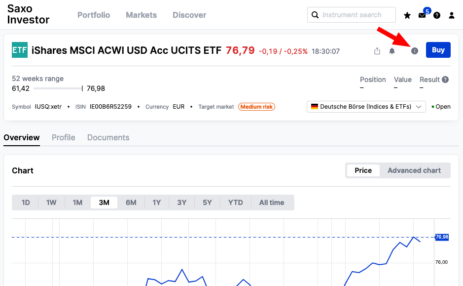
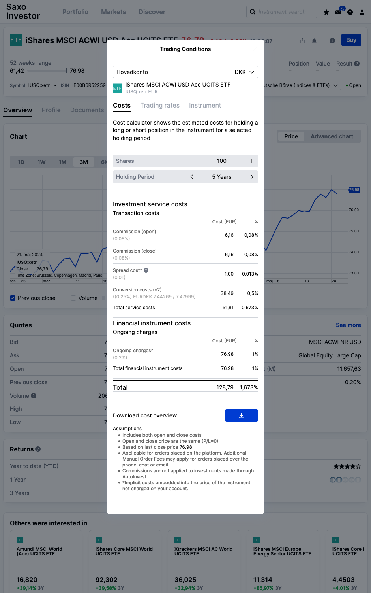

There are some fees tied to trading, some more, other less hidden.

## Ask, bid and spreads
Items traded on an exchange market are, like the name says, traded. Meaning, there is no unlimited supply of anything and for anything to be bought, there must be someone willing to sell it, and vice versa.

When it comes to investing on exchange markets, two key prices come into play:
- **Ask Price**: This is the price at which someone is willing to sell their share of a Stock, ETF or Danish Investment Fund for.
- **Bid Price**: Conversely, the bid price is the price at which someone is willing to buy a Stock, ETF or Danish Investment Fund for.

The difference between these two prices is known as the **Spread**. For example, if a Stock has a bid price of $5 and an ask price of $5,05, the spread would be $0,05.

For popular and highly traded products like the "Amazon.com Inc." Stock, the spread is typically insignificant due to consistent demand and supply. 

However, stocks with low trading volume can exhibit a high spread, potentially inflating the cost and risk of investing. Imagine purchasing a Share for $50, only to find you can only immediately sell it for $40 — that's a $10 difference, effectively a loss right after purchase.
Furthermore, consider the challenge of selling something nobody desires. If you're stuck with it, you might have to settle for a lower price just to get rid of it. 
High spreads mean you're losing more upfront in any deal and indicate a difficulty in finding buyers.

## Costs of Funds

### Management Fee
We had a quick glance at costs involved with Funds in "[2. What can you invest in](https://dk-invest-101.github.io/What%20can%20you%20invest%20in#fees)". Both can either be actively managed or passively managed that you have to pay for. These costs are known as **Management Fees (DK: "Forvaltningsomkostninger" or "Administrationsomkostninger")** and are typically charged on a daily basis but expressed as an annual percentage. For example, a 0,5% management fee translates to a daily deduction of 0,5% / 365 days = 0,00137%.

> Management fees encompass various expenses such as legal fees, IT expenses, marketing, and salaries.

Passively Managed Funds, such as ETFs, generally have lower management fees, sometimes as low as 0,05%. On the other hand, Actively Managed Funds, like Mutual Funds, typically charge higher fees, usually ranging from 2% to 3%.

For context, research by Morningstar revealed that the average management fee for Passively Managed Funds was approximately [0,37% in 2022](https://www.investopedia.com/ask/answers/071816/how-are-etf-fees-deducted.asp).

### Exit/Entry Fees
Some Funds charge additional fees when buying or selling Funds. These charges are used to cover the fees for buying the underlying Stocks. These fees are called _entry fees_ (DK: Indtrædelseomkostninger) or _exit fees_ (DK: Udtrædelsesomkostninger) and only apply to Mutual Funds, but not ETFs or Danish Investment Funds.

> ##### Why don't Entry/Exit fees apply to ETFs or Danish Investment Funds?
> ETFs or Danish Investment Funds are traded on the Stock Exchange Markets, which means investors buy and sell Shares directly from other investors, not from the Fund company. With Mutual Funds, the Fund company might individually purchase new underlying Stocks upon entry.

### Fund costs Metrics: ÅOP & PRIIP
**ÅOP (Årlige Omkostninger i Procent)** is a Danish metric showing the total expenses of owning an Fund over seven years, as a percentage of its assets. These costs cover management fees, administrative costs, and others, allowing you to easy compare different Funds fees. The global equivalent is the _"Total Expense Ratio" (TER)_, which focuses only on the annual running costs instead of a seven-year period.

**PRIIP (Packaged Retail Investment and Insurance Products)** is an EU-wide regulation introduced in 2022, in an attempt to provide retail investors (the little fishes like you and me) with standardized information about Funds. This information is presented in a document called **KID (Key Information Document)** on risks, costs, and includes investment simulations for the Funds' performance over good and bad years.

## Costs associated with Investing
There are further costs to consider while investing, which the investment platforms (e.g. Banks or Trading platforms like SAXO) impose fees on:
- **Brokerage fee** (DK: Kurtage gebyr): Each time you trade a Security (ETF, Stock,...) you pay a one-time fee to execute the trade. This is called brokerage fee. Brokerage fee largely depends on which country and exchange the Security is traded at. Brokerage fees are sometimes also referred to as Commission fees.
- **Custody fee** (DK: Depotgebyr): Some investment platforms or banks charge you a half-yearly or annual fee for storing & managing your investments. These are entirely different fee's from managing the Fund. These fees go towards the bank or investment platform.
- **Foreign exchange fee** (DK: Vekselomkostninger/valutavekslingsgebyr): When investing in a product that is not traded in the same currency as your account, then you'll pay an exchange fee on your trade. In 2024, this is 0.25% for most banks and Investment Platforms.

## Where can I find out what I would be charged for an investment?
Some platforms, like SAXO, have built-in calculators that show you the exact costs at the time of purchase. Here's how to find them:
1. Look for an information icon (i) next to the investment you're interested in (like an ETF or Stock) on SAXO. Click on that icon.  
2. In the information window, navigate to the "Costs" tab.  

This will show you a breakdown of the fees involved. In above screenshot, buying 100 IUSQ ETFs, which cost 76 EUR (567 DKK) each, you'll be charged a fee of 128 EUR or 955 DKK. This can seem like a lot, but here the conversion cost is listed twice for both when you buy the ETFs and when you sell them later. So, the actual fee you pay upfront is half of the listed amount, around 477 DKK, when making a 56.700 DKK investment.
