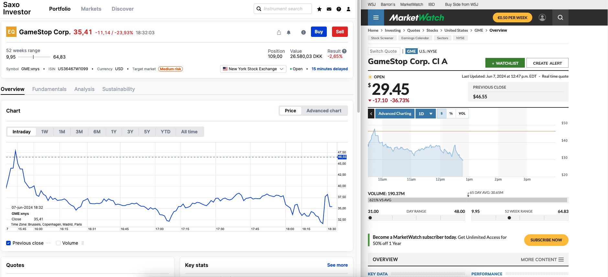

Today, you can invest with your bank or a dedicated Investment Platform. They may provide all sorts of investment accounts (_Aktiesparekonto_, Saving Accounts, ...) or investment products.

There's a significant price difference depending on the bank or investment platform you use for trading. With Investment Platforms, we mean platforms that provide only investment services such as [Saxo](https://www.home.saxo/) or [Nordnet](https://www.nordnet.dk)

From [7. Costs of Investing#Costs associated with Investing](https://dk-invest-101.github.io/Costs%20of%20Investing) we've seen brokerage, custody and foreign exchange fees.

Traditionally, banks are known to be more expensive compared to pure Investment Platforms like [Saxo](https://www.home.saxo/) or [Nordnet](https://www.nordnet.dk). The latter ones don't have Custody fees, meaning you only pay Brokerage and, if applicable, Foreign Exchange fees.

The Danish internet has battled for a long time which Investment Platform is better. Saxo has the clear advantage that it provides a larger product palette and the platform exists in multiple languages. [Saxo offers access to 31 stock exchanges](https://www.home.saxo/rates-and-conditions/stocks/commissions), whereas [Nordnet provides access to only 8](https://www.nordnet.dk/dk/marked/handelskalender). Nordnet is in Danish only, but offers pension accounts. Since recently, both Nordnet and Saxo have ["Månedsopsparing"](https://www.nordnet.dk/dk/kundskab/academy/manedsopsparing/hvad-er-en-manedsopsparing) (Eng: Monthly savings). "Månedsopsparing" is not an account, but a service that automatically invests each month an amount into a product(s) of your choice [without brokerage fees!](https://www.nordnet.dk/dk/kundskab/academy/manedsopsparing/hvad-er-en-manedsopsparing)

Regardless of which one you pick, you'll make a good choice with either one. Nordnet and Saxo both provide _Aktiesparekontos_ and automatically report to SKAT.

### Order Types
Investors have different ways to buy securities. These ways are called **Order Types**.

Two of the most basic _Order Types_ are **Market Orders** and **Limit Orders**.

#### Market Orders
If you place a buy market order, you are saying, "I want to buy this Security right now at whatever price someone is willing to sell it for". 

Similarly, if you place a sell market order, you are saying, "I want to sell this Security right now at whatever price someone is willing to buy it for." The main advantage of a market order is that it gets executed quickly, but you don't have control over the exact price you'll pay or receive.

#### Limit Orders
A limit order is a type of order you place to buy or sell a Security at a specific price that you choose. When you place a buy limit order, you set the highest price you are willing to pay for the Security. Your order will only be filled if the price drops to that level or lower. 
When you place a sell limit order, you set the lowest price you are willing to accept for the Security. Your order will only be filled if the price rises to that level or higher. 

These limit orders actually make up the **Ask prices** (for sell limit orders) and **Bid prices** (for buy limit orders) in the market. In fact, these are the prices that determine the buy/sell prices for market orders.

The advantage of a limit order is that you control the price at which the trade happens, but there's no guarantee that your order will be executed if the market doesn't reach your specified price. 

#### Example
Imagine you want to buy shares of a company. If you place a market order, you are saying, "I want to buy these shares right now at the current market price." Let's say the current price is 300 DKK. Your order will only be filled at around 300 DKK, but it might be slightly higher or lower depending on what the sellers (those placing limit orders) are asking for at that moment.

On the other hand, if you place a limit order with a maximum price of 296 USD, you are saying, "I want to buy these shares, but only if I can get them for 296 DKK or less." Your order will only be filled if the price drops to 296 DKK or below. If the price stays above 296 DKK, your order won't be executed.

## Stock Exchanges
When investing through platforms like Saxo or Nordnet, they're just facilitating access to many stock exchanges where the actual trading happens. These are the Stock Exchanges you'll most likely be trading on:

| Name                        | Country        | Market Code | Opening hours (Denmark Time UTC +1)                                                                                                          | Note                                                                                                                                             |
|:--------------------------- |:-------------- |:----------- |:-------------------------------------------------------------------------------------------------------------------------------------------- |:------------------------------------------------------------------------------------------------------------------------------------------------ |
| NASDAQ                      | USA            | XNAS        | [Monday to Friday
15:30 to 22:00(Varies for Summer and Winter time)
](https://www.nasdaq.com/stock-market-trading-hours-for-nasdaq) | Offers most American Stocks                                                                                                                      |
| Deutsche Börse XETRA        | Germany        | XETR        | [Monday to Friday
9:00 - 17:30
 ](https://www.xetra.com/xetra-en/trading/trading-calendar-and-trading-hours)                        | You read correct, XETRA is the name and XETR is the code                                                                                         |
| Milan Stock Exchange        | Italy          | XMIL        | [Monday to Friday
9:00 - 17:30
 ](https://www.borsaitaliana.it/azioni/mercati/negoziazioni/negoziazioni/negoziazioni.en.htm)        |                                                                                                                                                  |
| London Stock Exchange (LSE) | United Kingdom | XLON        | [Monday to Friday
9:00 - 17:30
 ](https://www.tradinghours.com/markets/lse)                                                         |                                                                                                                                                  |
| Euronext Amsterdam          | Netherland     | XAMS        | [Monday to Friday
9:00 - 17:30
 ](https://www.tradinghours.com/markets/euronext)                                                    | Do not impart "Euronext" = "Euronext Amsterdam". Euronext is a group of stock exchanges and there is also Euronext Brussels (XBRU) as an example |

> Remember, Bonds and Mutual Funds are bought directly through their providers on SAXO or Nordnet and are not traded on an Stock Exchange like Stocks, ETF or Danish Exchange Traded Funds.

#### Pre-market & After-hours trading
U.S. stock market exchanges—particularly the New York Stock Exchange (NYSE) and the Nasdaq—typically open at 9:30 (15:30 CET time) and close at 16:00 Eastern time (22:00 CET time).

However, thanks to **Pre-market** and **After-hours** trading, investors can buy and sell as early as 4:00 (10:00 CET time) and as late as 20:00 Easter time (2:00 CET time the following day). These periods are also known as **Extended hours**. Not all platforms support these trading periods, as they carry several risks. Since these periods only have a few participants there is no guarantee that a particular trade will be executed and the markets are highly volatile with high price swings. Moreover, only **Limit order** types are available during pre-market and after-hours trading.

## 15-min Delaye
When you are ready to invest, you might notice a "15 minutes delayed" note next to the "Open" indicator on SAXO or a clock icon on Nordnet. This indicates that real-time data for some markets, such as the USA and Canada, is a premium feature.

For low-volatility ETFs or Danish Exchange Traded Funds, this delay is generally not an issue. However, for day trading, especially with high-volatility stocks, a 15-minute delay can have catastrophic consequences.

For example, on June 7th, 2024, the price of GameStop (GME) fluctuated significantly. Imagine wanting to sell stocks at a market price of 35 USD, only to find they were actually sold for 29 USD because SAXO's data was 15 minutes behind. The screenshot from that date below illustrates this scenario.

 

Sources: [1](https://www.nordnet.dk/faq/1731-hvordan-ved-jeg-om-en-kurs-er-i-realtid) [2](https://www.nordnet.dk/faq/6282-hvorfor-er-nogle-kursalarmer-forsinket-med-15-minutter), [3](https://www.help.saxo/hc/da/articles/360001286826-Hvordan-tilmelder-jeg-mig-realtidskurser)