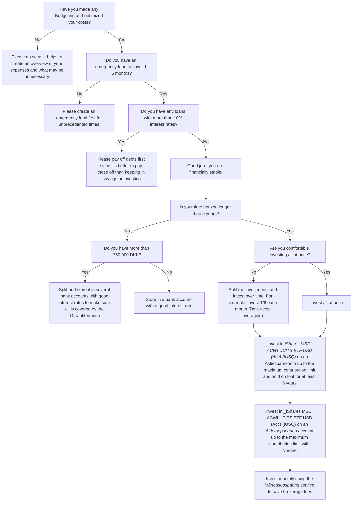

Use the following simple flowchart as a tool for making decisions
 

Visit the [Flowchart Backup](https://github.com/dk-invest-101/dk-invest-101.github.io/blob/main/docs/Investing%20Flowchart.mdx) if the Flowchart renders incorectly.

