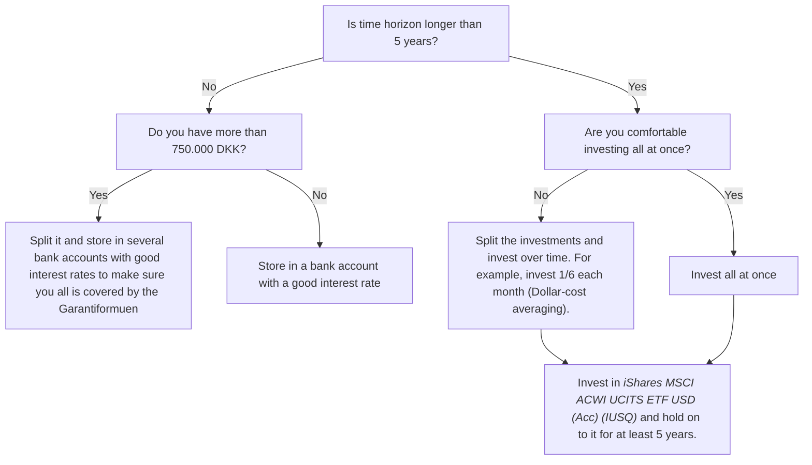

Use the following simple flowchart as a tool for aiding in decisions
 

```mermaid
flowchart TD
    A[Is time horizon longer than 5 years?]
    A -->|No| B[Do you have more than 750.000 DKK?]
    B -->|Yes| B1["`Split it and store in several bank accounts with good interest rates to make sure you all is covered by the Garantiformuen`"]
    B -->|No| B2["`Store in a bank account with a good interest rate`"]
    A -->|Yes| C["`Are you comfortable investing all at once?`"]
    C -->|No| D["`Split the investments and invest over time. For example, invest 1/6 each month (Dollar-cost averaging).`"]
    C -->|Yes| E["`Invest all at once`"]
    D --> X["`Invest in _iShares MSCI ACWI UCITS ETF USD (Acc) (IUSQ)_ and hold on to it for at least 5 years.`"]
    E --> X
```
